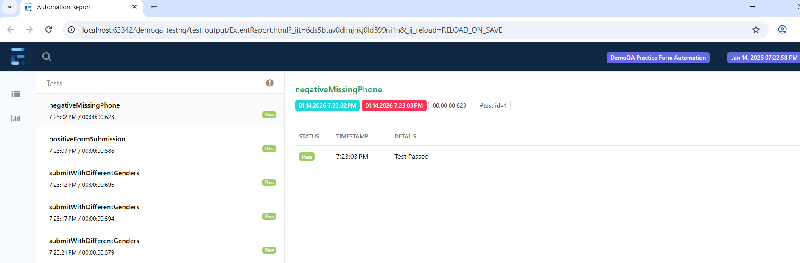

# DemoQA Practice Form Automation

##  Project Overview

This is a **Selenium + TestNG automation framework** for the [DemoQA Practice Form](https://demoqa.com/automation-practice-form).  

It demonstrates **Page Object Model (POM), data-driven tests, validations, and reporting**.  
The framework is designed to be **scalable, maintainable, and enterprise-ready**.

---

## Tech Stack

| Technology | Version |
|------------|---------|
| Java       | 17      |
| Selenium   | 4.18.1  |
| TestNG     | 7.9.0   |
| Maven      | 3.9.3   |
| WebDriverManager | 5.7.0 |
| IntelliJ IDEA | 2025.2 |

##  Project Structure

src/test/java

 base -- BaseTest.java                # Handles TestNG setup/teardown

 pages -- PracticeFormPage.java       # Page Object Model for the form

 tests -- PracticeFormTest.java       # Positive & Negative tests
       -- DataDrivenTest.java         # Data-driven test examples

 utils -- DriverFactory.java          # WebDriver initialization

##  Features

- Fill Practice Form with **valid data** and submit successfully  
- Validate **mandatory fields**  
- Support **data-driven testing** (different genders)  
- **Page Object Model** design for maintainability  
- **DriverFactory** for centralized browser management  
- Handles dynamic UI issues like **ads/iframes using JS click**  

## How to Run

1. Clone the repository:

git clone https://github.com/dishaakkara/demoqa-testng.git

2. Navigate to the project folder:

cd demoqa-testng

3. Run the tests using Maven:

mvn clean test

Or run via **TestNG XML** in IntelliJ:

- Right-click `testng.xml` → Run  
##  Best Practices Followed

- Page Object Model (POM)  
- DriverFactory for centralized WebDriver management  
- BaseTest for clean TestNG lifecycle  
- Encapsulation & clean method design in Page Classes  

Screenshot Example
